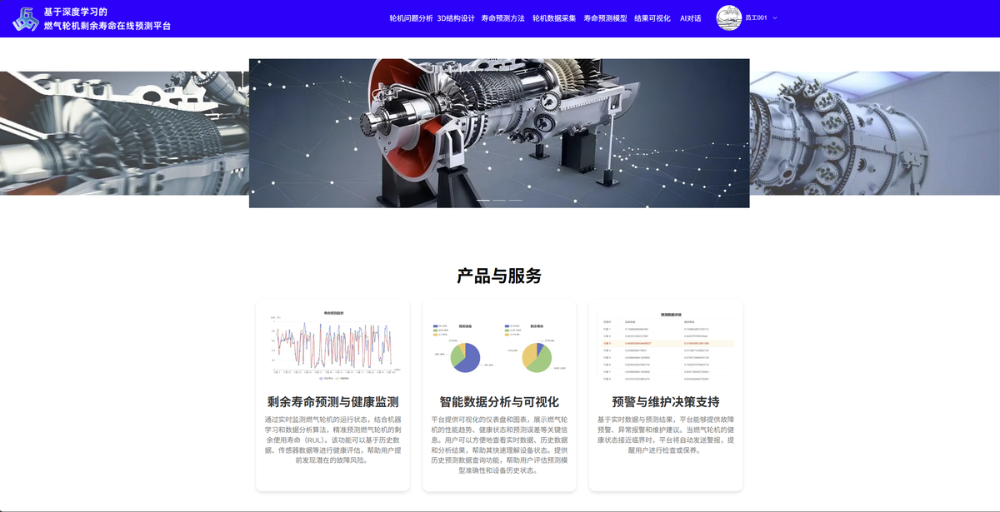
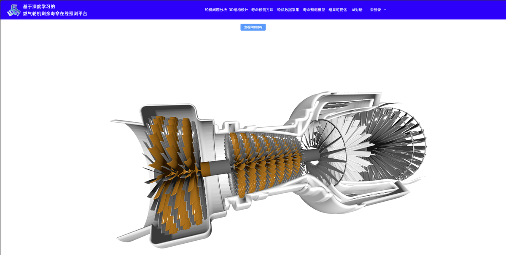
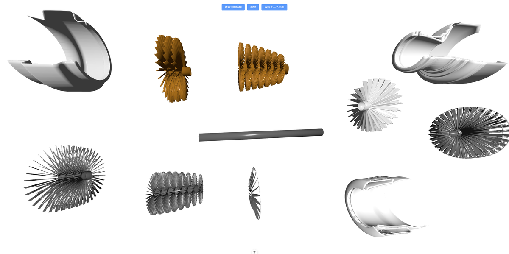
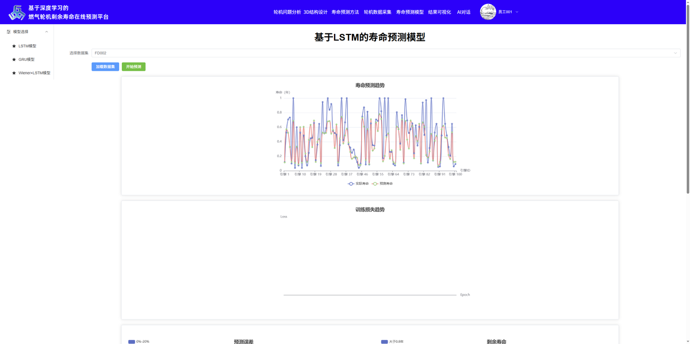
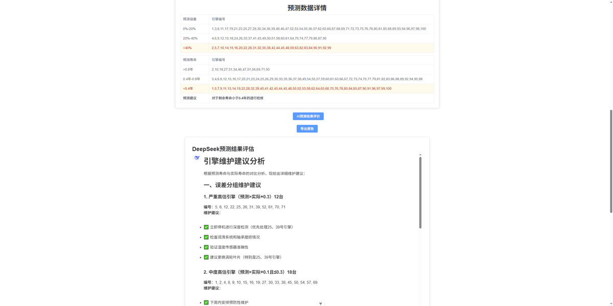
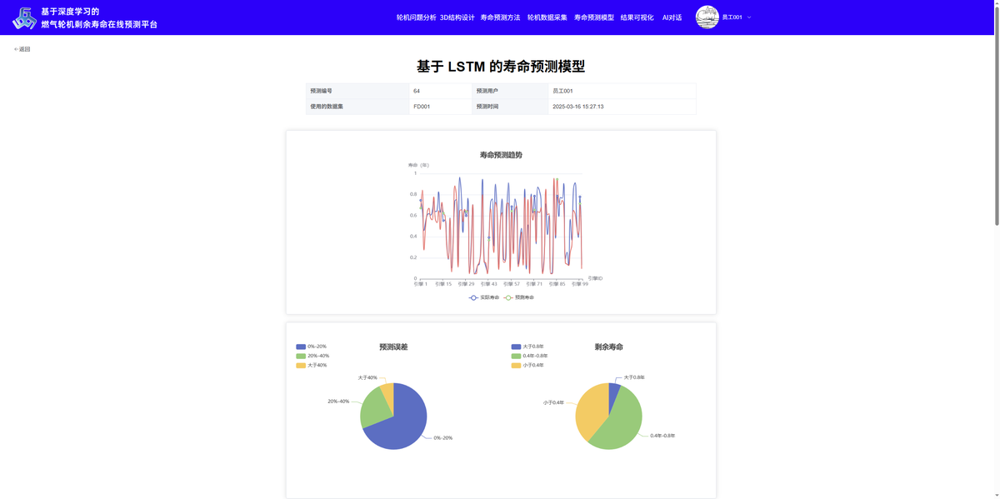
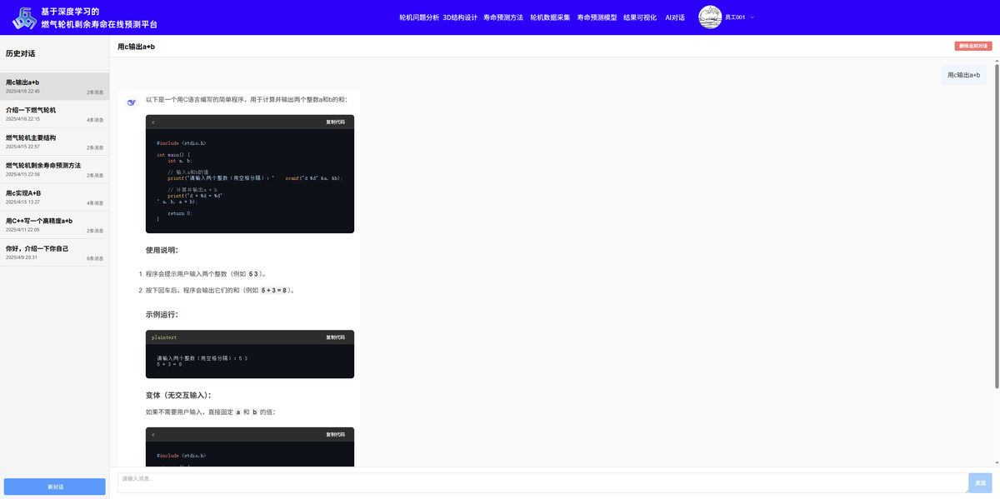
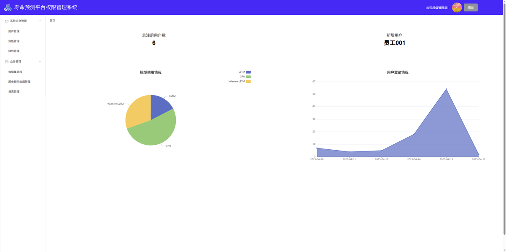

# 基于深度学习的燃气轮机剩余使用寿命预测平台

## 项目背景

燃气轮机在航空、发电、工业驱动等领域广泛应用，被称为动力机械中的"皇冠上的明珠"。其核心部件（叶片、燃烧室、机匣等）在高温、高压、高转速等极端工况下长期运行，容易出现疲劳裂纹、氧化损伤、涂层脱落、磨损腐蚀等多种故障模式。一旦发生突发性故障，单次计划外停运损失可达数百万元。

实际上 **80% 的燃气轮机故障并非瞬时发生**，而是经历一个渐进退化过程，会表现出可监测的故障征兆（振动频谱异常、温度分布偏移、叶片压力波动等）。本项目基于深度学习技术，对 NASA C-MAPSS 涡扇发动机数据集进行分析建模，构建了一套 **燃气轮机剩余使用寿命（Remaining Useful Life, RUL）预测平台**——用户上传传感器采集数据，系统自动预处理并调用预训练深度学习模型进行 RUL 预测，并结合大语言模型生成维护建议。

## 系统架构

```
┌─────────────────────────────────────────────────────────────────┐
│                  用户端 (vue-project)                            │
│    Vue 3 + Vite + Element Plus + Three.js + ECharts + GSAP      │
│    http://localhost:537                                          │
├─────────────────────────────────────────────────────────────────┤
│                  管理端 (vue-project-demo)                       │
│    Vue 2 + Element UI + ECharts                                 │
│    http://localhost:7000                                         │
├─────────────────────────────────────────────────────────────────┤
│                  后端服务 (demo)                                 │
│    Spring Boot 2.5 + MyBatis-Plus + JWT + Redis + MySQL         │
│    http://localhost:8080                                         │
├─────────────────────────────────────────────────────────────────┤
│                  ML 推理服务 (Turbofan-engine-RUL-prediction)     │
│    Python Flask + PyTorch — CNN+LSTM / CNN+GRU / Wiener+LSTM     │
│    http://localhost:5000                                         │
└─────────────────────────────────────────────────────────────────┘
```

## 功能模块

系统包含六大功能模块：

| 模块 | 说明 |
|---|---|
| **轮机结构模块** | 燃气轮机知识科普、3D 可视化模型（SolidWorks 建模 → Blender 动画 → Three.js 渲染），支持爆炸图、旋转缩放 |
| **轮机数据采集模块** | 数据集上传与管理，自动预处理（归一化、滑动窗口），支持多数据集 |
| **轮机寿命预测算法模块** | 三种深度学习模型：CNN+LSTM、CNN+GRU、Wiener+LSTM 混合模型 |
| **数据可视化与分析模块** | ECharts 交互图表展示预测结果，支持 PDF 报告导出，AI 分析评论 |
| **系统信息管理模块** | 后台用户管理、角色管理、权限分配（基于 RBAC） |
| **业务管理模块** | 数据集管理、历史预测记录管理、操作日志审计 |

## 三种预测模型

本项目实现了三种深度学习模型，均结合了 CNN（局部特征提取）与 RNN 变体（时序建模）：

| 模型 | 架构 | 特点 |
|---|---|---|
| **CNN + 双向 LSTM** | 双流 LSTM（150 隐藏单元）+ 1D CNN（128→64 通道） + Dropout | 擅长捕获长期退化趋势，适合单一工况 |
| **CNN + 双向 GRU** | 双流 GRU（150 隐藏单元）+ 1D CNN（128→64 通道） + Dropout | 参数更少、训练更快，适合实时性要求高的场景 |
| **Wiener + LSTM 混合** | Wiener 随机过程 + 双向 LSTM + CNN，双分支特征融合 | 结合物理退化建模与数据驱动，在复杂工况下表现最优 |

所有模型均使用 Adam 优化器（lr=0.001），训练 10 个 epoch，batch size=64。

## 技术栈

| 层级 | 技术 | 说明 |
|---|---|---|
| 用户前端 | Vue 3.5, Vite 6, TypeScript, Element Plus 2.9, Pinia, Vue Router 4, Three.js 0.174, ECharts 5.6, GSAP 3.12, Axios | MVVM 架构，响应式数据绑定 |
| 管理前端 | Vue 2.6, Vue CLI 5, Element UI 2.15, Axios | 经典 Vue 2 后台管理 |
| 后端 | Spring Boot 2.5, MyBatis-Plus 3.4, Spring AOP, JWT (jjwt 0.9), Redis (Lettuce), MySQL 5.7, Swagger 2, Aliyun OSS | Controller-Service-Mapper 分层架构 |
| ML 推理 | Python 3, PyTorch, Flask + flask-cors, NumPy, SciPy | Flask RESTful API, 支持 GPU 加速 |

### 关键技术与设计亮点

- **前后端分离**：Vue + SpringBoot 架构，通过 RESTful API 通信，支持独立部署与并行开发
- **Redis 缓存**：热点数据（如历史预测记录）缓存在 Redis，毫秒级响应，降低数据库压力
- **大语言模型赋能**：集成 DeepSeek-V3 API，自动分析预测结果，生成多维维护建议报告
- **3D 可视化**：SolidWorks 精确建模 → Blender 动画制作 → Three.js WebGL 渲染，支持 360° 旋转、缩放、爆炸图
- **行业标准级开发**：Swagger 文档 + 分层架构 + 存储过程，代码高内聚低耦合

## 目录结构

| 目录 | 说明 | 端口 |
|---|---|---|
| `vue-project/` | 用户端前端 | 537 |
| `vue-project-demo/` | 管理端前端 | 7000 |
| `demo/` | Spring Boot 后端 | 8080 |
| `Turbofan-engine-RUL-prediction/` | Python Flask ML 推理服务 | 5000 |
| `design-images/` | 界面截图（仅 thumb_ 缩略图需上传） | — |

## 环境要求

| 软件 | 版本 | 用途 |
|---|---|---|
| Node.js | 16+ | 前端运行 |
| Java JDK | 9+ (编译) / 1.8 (运行) | Spring Boot |
| Maven | 3.6+ | Java 依赖管理 |
| Python | 3.8+ | ML 推理 |
| MySQL | 5.7+ | 数据持久化 |
| Redis | 7.0+ | 缓存与分布式锁 |

开发工具：VSCode（前端）、IntelliJ IDEA（后端）、PyCharm（ML）

## 本地启动

### 启动顺序

```
① MySQL + Redis → ② Flask ML (:5000) → ③ Spring Boot (:8080) → ④ 前端 (:537) + 管理端 (:7000)
```

### 第一步：数据库与缓存

确保本地 MySQL 和 Redis 已启动，创建数据库：

```sql
CREATE DATABASE IF NOT EXISTS powersystem DEFAULT CHARACTER SET utf8mb4;
```

### 第二步：ML 推理服务

```bash
cd Turbofan-engine-RUL-prediction
pip install torch numpy scipy flask flask-cors matplotlib
python main.py
```

接口：`GET http://localhost:5000/load-dataset` / `GET http://localhost:5000/get-rul-data`

### 第三步：后端服务

编辑 `demo/src/main/resources/application.yml`，将数据库和 Redis 改为本地地址：

```yaml
server:
  port: 8080
spring:
  datasource:
    url: jdbc:mysql://localhost:3306/powersystem?useUnicode=true&characterEncoding=UTF-8&serverTimeZone=Asia/Shanghai
    username: root
    password: 本地MySQL密码
  redis:
    host: localhost
    port: 6379
    password:
```

```bash
cd demo
mvn clean install -DskipTests
mvn spring-boot:run
```

Swagger 文档：http://localhost:8080/swagger-ui.html

### 第四步：前端

```bash
# 用户端
cd vue-project && npm install && npm run dev      # → http://localhost:537

# 管理端
cd vue-project-demo && npm install && npm run serve  # → http://localhost:7000
```

## 端口一览

| 服务 | 端口 | 验证 |
|---|---|---|
| 用户前端 | 537 | `curl http://localhost:537` |
| 管理前端 | 7000 | `curl http://localhost:7000` |
| Spring Boot | 8080 | `curl http://localhost:8080/swagger-ui.html` |
| Flask ML | 5000 | `curl http://localhost:5000/load-dataset` |

## 数据集

NASA C-MAPSS (Commercial Modular Aero-Propulsion System Simulation) 涡扇发动机退化模拟数据集：

| 子集 | 训练样本 | 测试样本 | 运行条件 | 故障模式 |
|---|---|---|---|---|
| FD001 | 100 | 100 | 1 种 | HPC 退化 |
| FD002 | 260 | 259 | 6 种 | HPC 退化 |
| FD003 | 100 | 100 | 1 种 | HPC + Fan 退化 |
| FD004 | 248 | 248 | 6 种 | HPC + Fan 退化 |

每个样本含 21 个传感器测量值 + 3 个操作设置参数。

## 界面展示

### 用户端

| 首页 | 登录 |
|---|---|
|  |  |

| 3D 轮机结构 | 轮机详情 |
|---|---|
|  |  |

| 预测结果 | AI 智能对话 |
|---|---|
|  |  |

| 数据可视化 |
|---|
|  |

### 管理端

| 后台首页 | 用户管理 |
|---|---|
|  |  |

## 配置文件说明

后端配置文件 `demo/src/main/resources/application.yml` 包含真实凭据，已加入 `.gitignore`。仓库提供了模板文件 `application.example.yml`，首次使用时：

```bash
cp demo/src/main/resources/application.example.yml demo/src/main/resources/application.yml
```

然后编辑 `application.yml` 填入你的本地配置：

| 配置项 | 说明 |
|---|---|
| `spring.datasource` | MySQL 连接（url / username / password） |
| `spring.redis` | Redis 连接（host / port / password） |
| `aliyun.oss` | 阿里云 OSS 配置（文件上传功能需要） |
| `deepseek.api.key` | DeepSeek API Key（AI 对话功能需要） |

## 注意事项

- 页面图片资源托管于 Aliyun OSS，本地开发时可能无法加载，可将图片下载至 `vue-project/src/assets/` 并替换引用路径
- ML 模型权重文件（`.pth`）已加入 `.gitignore`，需要时从 `Turbofan-engine-RUL-prediction/Model_Parameter/` 自行训练生成
- 前端各页面中存在硬编码的后端地址（`localhost:8080` / `127.0.0.1:5000`），部署到非本地环境时需统一修改
